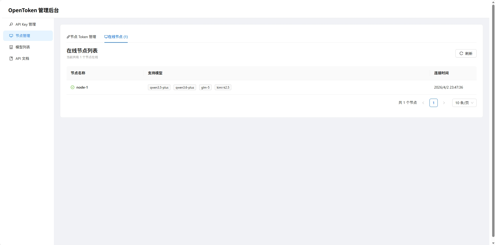
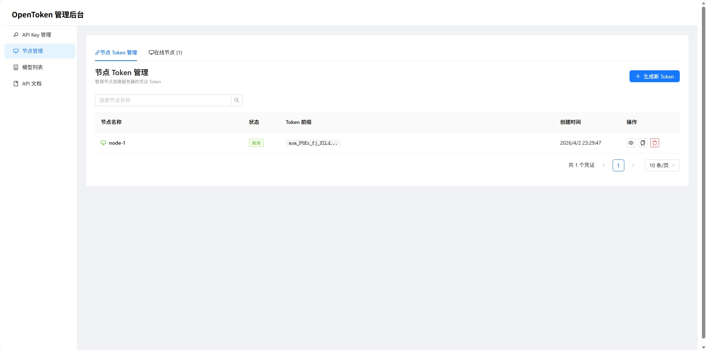
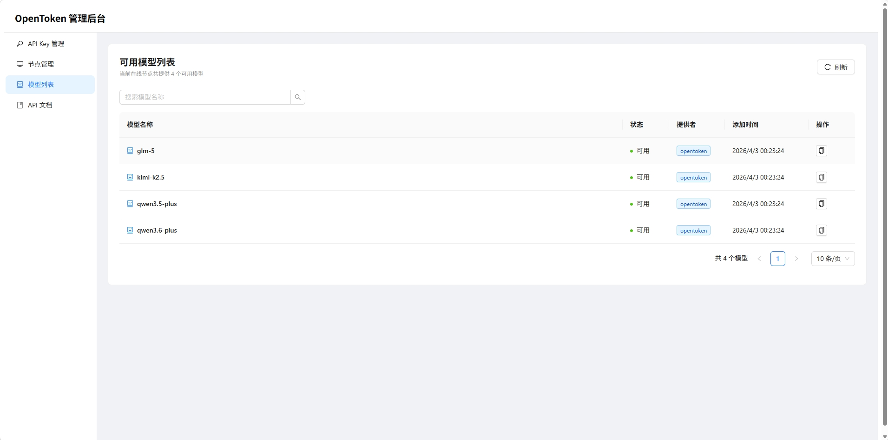
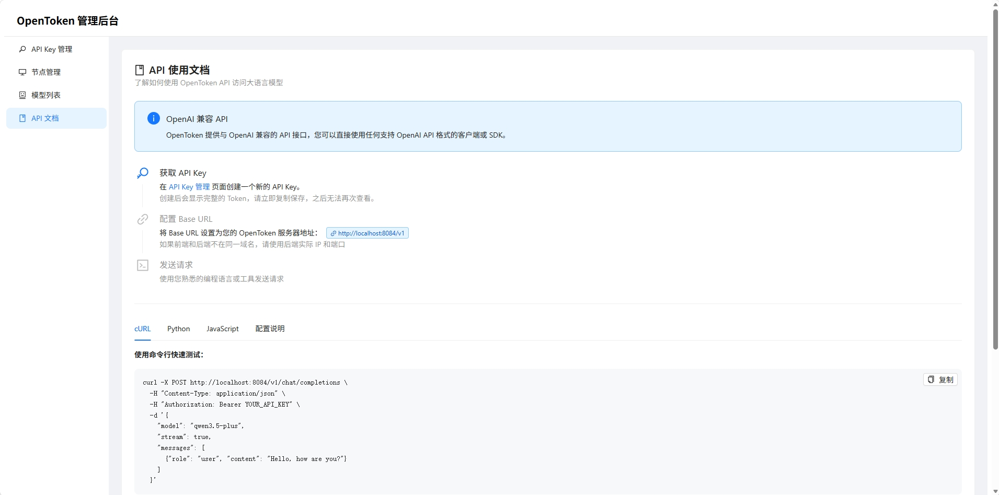

# OpenToken

[中文文档](docs/README_zh.md)

OpenToken is a high-performance, scalable LLM (Large Language Model) gateway and distribution system. It adopts a Server-Node architecture designed to provide developers with a unified, flexible, and secure API access point.

## Project Architecture

- **opentoken-server**: The central control node responsible for API routing, user authentication, node management, quota control, and frontend display.
- **opentoken-node**: The execution node responsible for communicating with actual LLM upstreams (e.g., OpenAI, Anthropic, Ollama) and streaming back results.
- **frontend**: The web frontend built with React + Vite + TypeScript, providing a user interface for managing and monitoring the system.

## Key Features

- **Architectural Decoupling**: Separation of Server and Node, supporting cross-region and cross-cloud deployment.
- **High Performance**: Developed in Go, with native support for high-concurrency long connections.
- **Streaming Support**: Full-link streaming response support.
- **Flexible Configuration**: Supports MySQL/SQLite storage and multiple OSS providers.

---

## Interface Preview

### Node Management





### Model Management



### API Management




---

## Local Deployment Guide

### Prerequisites

- **Go**: Recommended version 1.25.1 or higher.
- **Database**: Optional MySQL or built-in SQLite.

### 1. Configuration File Locations

- Server Configuration: `opentoken-server/config.yaml`
- Node Configuration: `opentoken-node/config.yaml`

### 2. Server Configuration and Startup

#### 2.1 Modify Configuration (`opentoken-server/config.yaml`)

Edit the configuration file to ensure the database connection is correct:

```yaml
system:
  port: 8084
  db-type: sqlite # or use mysql
sqlite:
  db-path: "./opentoken-server.db"
```

#### 2.2 Start the Service

Navigate to the server directory and run:

```bash
cd opentoken-server
go run main.go
```

### 3. Node Configuration and Startup

#### 3.1 Get Node Token

Nodes require credentials to connect to the Server. After starting the Server, obtain them via the API:

```bash
curl -X POST http://127.0.0.1:8084/api/v1/node/credentials \
  -H "Content-Type: application/json" \
  -d '{"name":"node-local-1"}'
```

Note down the `token` from the response.

#### 3.2 Configure the Node (`opentoken-node/config.yaml`)

Edit the Node configuration file:

```yaml
node-agent:
    enabled: true
    server-ws-url: ws://127.0.0.1:8084/ws/node
    token: "YOUR_TOKEN"
    node-name: "node-local-1"
    models: ["qwen3.5:27b"]

upstream-llm:
    base-url: "http://localhost:11434/v1"
    api-key: "YOUR_API_KEY"
```

#### 3.3 Start the Node

Navigate to the node directory and run:

```bash
cd opentoken-node
go run main.go
```

### 4. Frontend Configuration and Startup

The frontend is a React application built with Vite and TypeScript.

#### 4.1 Prerequisites

- **Node.js**: Recommended version 18.x or higher.
- **npm** or **yarn**: Package manager.

#### 4.2 Install Dependencies

Navigate to the frontend directory and install dependencies:

```bash
cd frontend
npm install
```

#### 4.3 Development Mode

Start the development server:

```bash
npm run dev
```

The frontend will be available at `http://localhost:3000`. The development server automatically proxies API requests to the backend server at `http://localhost:8084`.

#### 4.4 Production Build

Build the frontend for production:

```bash
npm run build
```

The built files will be in the `dist` directory. You can preview the production build with:

```bash
npm run preview
```

#### 4.5 Test Environment

For testing purposes, you can use:

```bash
npm run test:dev    # Start dev server in test mode
npm run test:build  # Build for test environment
```

## Node Management & Monitoring

### 1. Query Online Nodes

This endpoint allows you to retrieve a list of all nodes that are currently connected and active, along with their metadata (such as node name and supported models).

- **Method**: `GET`
- **Endpoint**: `/api/v1/node/online`
- **Example**:

```bash
curl http://127.0.0.1:8084/api/v1/node/online
```

**Response Details**:
Returns a JSON array containing detailed information for all online nodes. If a specific model is missing from the `models` list, it indicates that the node is either misconfigured or failed to load that model.

---

## Verification

### 2. Call Model via Server

Use the standard Chat Completion format to request the Server:

```bash
curl -N http://127.0.0.1:8084/v1/chat/completions \
  -H "Content-Type: application/json" \
  -d '{
    "model":"qwen3.5:27b",
    "stream":true,
    "messages":[{"role":"user","content":"Hello"}]
  }'
```

---

## FAQ

- **Node Connection Failed**: Check if `server-ws-url` is correct and inspect network firewalls.
- **Model Routing Failed**: Ensure the requested model name is declared in `node-agent.models`.
- **Token Issues**: If a Token is lost or leaked, regenerate credentials via the API and update the Node configuration.
